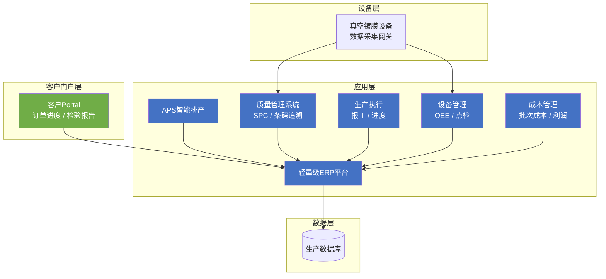

# 温州市国彩真空科技有限公司 ERP 解决方案

## 1. 客户现状与需求

### 项目概览

| 项目 | 内容 |
|------|------|
| **客户名称** | 温州市国彩真空科技有限公司（国彩真空） |
| **项目名称** | 国彩真空数字化运营管理平台 |
| **项目类型** | 新建 |
| **核心目标** | 构建覆盖生产、质量、设备、成本四大核心环节的轻量级ERP系统，提升交期准确率和良品率，降低管理成本 |
| **预计周期** | 3–4 个月 |

### 客户概况

国彩真空2017年成立，在瑞安塘下镇做PVD真空镀膜加工，服务五金、3C、汽摩配、眼镜、卫浴等多个行业，已经进入宜家、苏泊尔、吉利等品牌的供应商名单。公司约18人、4000平方米厂房，目前靠Excel和微信管理生产，还没有上系统。最大优势是48小时上门响应和12小时加急交付。

### 当前挑战

| # | 挑战 | 影响 | 紧迫性 |
|---|------|------|--------|
| 1 | 来料加工订单批次多、规格杂，人工排产效率低，插单和交期协调频繁出错 | 交期延误导致客户投诉，影响宜家等大客户考核评分 | 高 |
| 2 | 膜厚精度要求0.1微米，全检依赖人工记录，缺乏SPC统计过程控制，质量一致性存在隐患 | 良品率提升瓶颈，难以满足国际客户的供应商审核要求 | 高 |
| 3 | 真空镀膜设备运维依赖外部工程师，突发故障直接影响客户交期，OEE提升空间大 | 非计划停机造成产能浪费和违约风险 | 中 |
| 4 | 宜家、苏泊尔等客户要求供应商提供系统化质量数据和交付报告，Excel/微信无法满足数字化对接需求 | 客户流失风险，供应商评级受限 | 中 |
| 5 | 多品种小批量加工模式下，单批次材料损耗、工时、能源难以精确归集，报价和利润管理缺乏数据支撑 | 成本不透明，利润空间不可控 | 中 |

### 核心需求

**一句话总结**：国彩真空急需一套轻量级数字化系统，管好生产调度、质量追溯、设备运维和成本核算四大核心环节。

#### 业务需求

| # | 需求 | 优先级 | 来源 |
|---|------|--------|------|
| 1 | 生产调度与APS排程：针对多品种小批量的来料加工订单，实现智能排产和交期承诺 | P0 | 客户痛点/行业最佳实践 |
| 2 | 质量追溯与SPC控制：膜厚0.1微米精度管控，条码批次追溯，满足宜家等国际客户的审核要求 | P0 | 客户痛点/行业最佳实践 |
| 3 | 设备OEE与运维管理：真空镀膜设备运行数据采集，OEE分析，预测性维护提醒 | P1 | 客户痛点 |
| 4 | 客户门户与数据报告：为宜家、苏泊尔等大客户提供在线交付看板和质量数据报告 | P1 | 客户需求 |
| 5 | 批次成本核算：按订单归集材料损耗、工时、能源消耗，支撑精准报价和利润分析 | P1 | 客户痛点/行业最佳实践 |

#### 功能需求

| # | 需求 | 优先级 | 来源 |
|---|------|--------|------|
| 1 | 订单/批次管理：接收客户订单，按物料、颜色、膜厚规格分类管理，支持插单重排 | P0 | 业务需求推导 |
| 2 | 条码批次追溯：每批次镀膜任务绑定原料批次、工艺参数、检验数据，支持扫码追溯 | P0 | 业务需求推导 |
| 3 | 生产报工与进度跟踪：车间扫码报工，实时更新订单生产进度，交付预警 | P0 | 业务需求推导 |
| 4 | SPC质量控制图：膜厚均值图、控制图，异常自动预警，支持导出检验报告 | P0 | 业务需求推导 |
| 5 | 设备台账与点检：设备基础信息管理，日常点检记录，OEE自动计算 | P1 | 业务需求推导 |
| 6 | 客户门户：客户查看订单进度、下载检验报告、质量数据对接 | P1 | 业务需求推导 |
| 7 | 成本归集与利润分析：批次级工时、材料、能源成本自动归集，利润报表 | P1 | 业务需求推导 |

#### 技术需求

| # | 需求 | 优先级 | 来源 |
|---|------|--------|------|
| 1 | B/S架构，支持PC和移动端访问，18人规模无需复杂运维 | P0 | 业务需求推导 |
| 2 | 本地化部署或轻量云端部署，数据自主可控 | P1 | 小微企业特点 |
| 3 | 与现有设备数据接口对接（真空镀膜设备数据采集） | P1 | 业务需求推导 |

### 约束条件

| 约束类型 | 内容 |
|----------|------|
| **预算** | 小微制造企业，预算有限（具体金额待确认，建议控制在10–20万元以内） |
| **时间** | 尽快上线，建议3–4个月完成核心模块 |
| **规模** | 18人扁平化团队，系统操作需简洁易用 |
| **技术** | 本地化部署优先，不依赖复杂IT基础设施 |

---

## 2. 解决方案

### 整体思路

本方案围绕三个核心目标设计：交得快、管得住、说得清——交期准确、质量稳定、数据可查。做法上以轻量级ERP为核心，依次构建生产调度、质量追溯、设备运维和成本核算四个模块，先解决最痛的问题，其他的逐步补齐。

考虑到18人小微厂的实际情况，功能不求大而全，上线要快，员工要能用起来，初期投入也要控制住——订阅制或轻量私有化都可以谈。

### 方案架构

### 功能设计

| 功能模块 | 解决的问题 | 业务价值 |
|---------|-----------|---------|
| **APS智能排产** | 来料加工订单批次多、规格杂，人工排产效率低、易出错 | 自动按设备产能、工艺路径、交期约束排产，一键重排应对插单，减少交期协调时间60%以上 |
| **条码批次追溯** | 膜厚0.1微米精度要求，全检数据人工记录繁琐、易出错 | 扫码关联批次全流程数据（原料→工艺参数→检验数据→出货），满足宜家、苏泊尔审核要求，5分钟内完成批次追溯 |
| **SPC质量控制** | 缺乏统计过程控制，良品率提升遇到瓶颈 | 膜厚控制图自动绘制，异常实时预警，良品率提升目标3–5个百分点，检验报告一键导出 |
| **生产报工与进度** | 订单进度靠电话/微信跟进，信息不透明，客户询问频繁 | 车间扫码报工，客户通过门户实时查看进度，减少客服沟通成本50%以上 |
| **设备OEE管理** | 真空镀膜设备突发故障影响交期，OEE不透明 | 设备运行数据自动采集，OEE实时计算，预测性维护提醒，减少非计划停机 |
| **客户门户** | 宜家、苏泊尔要求供应商提供数字化数据报告 | 客户在线查看订单进度、下载检验报告、质量数据报表，减少人工催单和发邮件 |
| **批次成本核算** | 多品种小批量模式下成本不透明，报价缺乏数据支撑 | 批次级工时、材料、能源自动归集，利润报表支撑精准报价，提高报价效率 |

### 技术方案

| 层级 | 技术选型 | 说明 |
|------|---------|------|
| **架构** | B/S架构，Web端 + 移动端H5 | 18人团队无需安装客户端，维护成本低 |
| **部署** | 本地私有化或轻量云服务器 | 数据自主可控，适合制造业敏感工艺数据 |
| **数据库** | PostgreSQL | 开源可靠，支持复杂查询 |
| **排产引擎** | 轻量级APS规则引擎 | 基于约束的排产算法，支持设备产能、工艺路径、甘特图可视化 |
| **数据采集** | 设备网关 + OPC UA/Modbus | 真空镀膜设备运行数据实时采集，无需改造设备 |
| **条码追溯** | 条码标签 + 扫码枪/PDA | 兼容现有操作习惯，扫码即用 |

### 差异化优势

1. **PVD行业know-how**：内置真空镀膜工艺知识（磁控溅射、多弧离子镀的工艺参数和检验标准），开箱即用，无需大量定制
2. **快速追溯能力**：针对宜家等国际客户的供应商审核要求，预置批次追溯模板，5分钟完成一次完整追溯
3. **轻量级投入**：订阅制年费模式，初期投入控制在传统ERP的1/3以内，适合小微企业预算

---

## 3. 实施路径

### 阶段概览

| 阶段 | 周期 | 核心目标 | 关键交付物 |
|------|------|---------|-----------|
| **阶段一：基础平台** | 第1–2周 | 完成系统部署、基础数据初始化、用户培训 | 系统上线运行，完成基础数据导入 |
| **阶段二：核心模块** | 第3–8周 | 上线APS排产、条码追溯、报工管理三大核心模块 | 生产调度效率提升，批次追溯上线，客户门户可用 |
| **阶段三：质量与设备** | 第9–12周 | 上线SPC控制、设备OEE管理模块 | 质量数据自动采集，SPC预警可用，设备运行可视化 |
| **阶段四：成本与优化** | 第13–16周 | 上线批次成本核算，优化报表和看板 | 成本报表可用，全面进入数字化运营阶段 |

### 关键里程碑

| # | 里程碑 | 时间 | 验收标准 |
|---|--------|------|---------|
| 1 | 系统部署完成 | 第2周末 | 所有模块可登录，18名员工完成初始培训 |
| 2 | 首批订单上线运行 | 第6周末 | 实际生产批次接入系统，排产甘特图可用 |
| 3 | 客户门户上线 | 第8周末 | 宜家/苏泊尔可在线查看订单进度，满意度评估 |
| 4 | SPC预警上线 | 第10周末 | 膜厚控制图实时更新，异常预警可正常触发 |
| 5 | 全模块上线验收 | 第16周末 | 四大模块全部可用，成本报表可导出 |

---

## 4. 风险与下一步

### 风险识别与应对

| # | 风险 | 概率 | 影响 | 应对措施 |
|---|------|------|------|----------|
| 1 | 员工对数字化工具接受度低，操作抵触 | 中 | 高 | 选用操作简洁的界面，安排驻场培训1–2天，以"减少工作量"而非"管理监控"为推广话术 |
| 2 | 设备数据接口对接不顺利，影响OEE模块上线 | 中 | 中 | 签约前确认设备通信协议，提供数据采集方案兜底（手动录入+网关并行） |
| 3 | 大客户数据对接要求超出系统默认能力 | 低 | 高 | 签约前与大客户确认数据报告格式，预留2–3周定制开发缓冲期 |
| 4 | 实施周期超期，影响使用体验 | 中 | 中 | 采用敏捷迭代，每2周一个Sprint，及时暴露和解决阻塞问题 |
| 5 | 预算超支 | 低 | 中 | 严格按阶段验收，每阶段不超过预算比例；核心功能优先，非核心功能可延后 |

### 下一步行动

| # | 行动 | 负责方 | 建议时间 |
|---|------|--------|---------|
| 1 | 方案沟通与答疑 | 双方 | 本周内 |
| 2 | 现场调研与需求确认 | 我方（实施顾问） | 1周内 |
| 3 | 商务谈判与合同签订 | 双方 | 2周内 |
| 4 | 项目启动会 | 双方 | 合同签订后1周内 |

---

<!-- INTERNAL_NOTES
## 假设前提
- 预算基于小微企业行业水平估算（10–20万元），具体金额待商务确认
- 设备通信基于标准Modbus/OPC UA协议，实际接口需现场确认
- 客户门户数据格式参考宜家IWAY标准，实际需求以客户确认为准
- 实施周期按4个月估算，如需加快可压缩至3个月

## 知识库引用
- 参考模型：APS排产 | L3 | 用于第2章APS模块功能设计
- 参考模型：批次追溯系统 | L3 | 用于第2章条码追溯模块
- 参考方向：SPC统计过程控制 | L3 | 用于第2章质量控制模块
- 参考方向：设备OEE分析 | L2 | 用于第2章设备管理模块
-->
